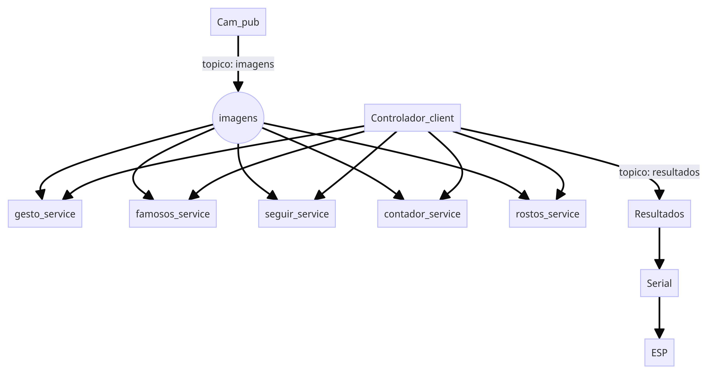

# Estrutura de ROS para Lisa

## Visão Geral
Esta branch contém a implementação da estrutura de comunicação do ROS utilizada no projeto Lisa, focando na interação entre os nós através de publishers, subscribers, services e clients. O código aqui presente estabelece como diferentes componentes do sistema comunicam-se, permitindo um fluxo de dados eficiente e organizado.

## Estrutura de Comunicação
A estrutura de comunicação é baseada em tópicos e nós do ROS, onde diferentes nós publicam e se inscrevem em tópicos específicos para trocar informações, além da utilização de serviços e clientes, onde o cliente principal controla e aciona os serviços. Isso inclui:

- **Publicadores (Publishers):** Nós que enviam dados, como imagens de vídeo ou informações sensoriais.
- **Subscritores (Subscribers):** Nós que recebem dados de outros nós para processamento ou ação subsequente.
- **Servidores (Servers):** Nós que oferecem serviços que podem ser acionados por outros nós.
- **Clientes (Clients):** Nós que solicitam a execução de serviços a partir dos servidores.

Esses componentes são essenciais para o funcionamento autônomo e a interatividade da Lisa, permitindo que o sistema responda de maneira dinâmica ao ambiente e aos comandos do usuário.

### Descrição dos Componentes

<details>
<summary>cam_pub.py</summary>

#### cam_pub.py
Este script é responsável por capturar imagens da câmera e publicá-las no tópico `/Imagens`.

- **Função `publish_message()`:** Captura imagens da webcam e as publica no tópico `/Imagens`.
  - **`pub = rospy.Publisher('/Imagens', Image, queue_size=10)`:** Inicializa o publisher para o tópico `/Imagens`.
  - **`cap = cv2.VideoCapture(0)`:** Abre a webcam.
  - **`pub.publish(br.cv2_to_imgmsg(frame))`:** Converte a imagem de OpenCV para o formato ROS e publica.

[Veja o código completo aqui](https://github.com/seu_usuario/seu_repositorio/blob/main/src/estrutura/scripts/cam_pub.py)
</details>

<details>
<summary>cam_sub.py</summary>

#### cam_sub.py
Este script se inscreve no tópico `/Imagens` e exibe os frames de vídeo recebidos.

- **Função `callback(data)`:** Recebe e exibe os frames de vídeo.
  - **`br = CvBridge()`:** Converte entre imagens ROS e OpenCV.
  - **`current_frame = br.imgmsg_to_cv2(data)`:** Converte a imagem ROS para OpenCV.
  - **`cv2.imshow("camera", current_frame)`:** Exibe o frame de vídeo.
- **Função `receive_message()`:** Inicializa o nó e se inscreve no tópico `/Imagens`.
  - **`rospy.Subscriber('/Imagens', Image, callback)`:** Se inscreve no tópico e define a função de callback.

[Veja o código completo aqui](https://github.com/seu_usuario/seu_repositorio/blob/main/src/estrutura/scripts/cam_sub.py)
</details>

<details>
<summary>contador_service.py</summary>

#### contador_service.py
Este script implementa o serviço de contagem de dedos utilizando MediaPipe.

- **Função `image_callback(msg)`:** Recebe a imagem do tópico `/Imagens`.
- **Função `process_image(event)`:** Processa a imagem para contar os dedos.
  - **`frame = bridge.imgmsg_to_cv2(self.image, desired_encoding='passthrough')`:** Converte a imagem ROS para OpenCV.
  - **`results = hands.process(frame_rgb)`:** Processa a imagem para detectar mãos.
  - **`self.update_finger_count_streak(finger_count)`:** Atualiza a contagem de dedos.
- **Função `handle_get_finger_count(req)`:** Retorna a contagem de dedos atual.

[Veja o código completo aqui](https://github.com/seu_usuario/seu_repositorio/blob/main/src/estrutura/scripts/contador_service.py)
</details>

<details>
<summary>gesto_service.py</summary>

#### gesto_service.py
Este script implementa o serviço de reconhecimento de gestos utilizando MediaPipe.

- **Função `detect_hand_gesture(frame)`:** Detecta gestos de mão na imagem.
  - **`mp_image = mp.Image(image_format=mp.ImageFormat.SRGB, data=image)`:** Converte a imagem para o formato MediaPipe.
  - **`recognition_result = recognizer.recognize(mp_image)`:** Reconhece gestos na imagem.
  - **`gesture = top_gesture.category_name`:** Obtém o nome do gesto reconhecido.
- **Função `image_callback(msg)`:** Recebe a imagem do tópico `/Imagens`.
  - **`current_image = msg`:** Armazena a imagem recebida.
- **Função `handle_gesture_recognition(req)`:** Processa a imagem e retorna o resultado do reconhecimento de gestos.
  - **`gesture = detect_hand_gesture(frame)`:** Detecta o gesto na imagem atual.
  - **`gesture_counts[gesture] += 1`:** Atualiza a contagem de gestos reconhecidos.
  - **`rospy.set_param('/stop_counting', False)`:** Habilita a contagem de dedos novamente após reconhecer o gesto 5 vezes.
- **Função `gesture_recognition_server()`:** Inicializa o nó do serviço de reconhecimento de gestos.
  - **`rospy.Service('/recognize_gesture', Trigger, handle_gesture_recognition)`:** Define o serviço para reconhecimento de gestos.
  - **`rospy.Subscriber('/Imagens', Image, image_callback)`:** Inscreve-se no tópico de imagens.

[Veja o código completo aqui](https://github.com/seu_usuario/seu_repositorio/blob/main/src/estrutura/scripts/gesto_service.py)
</details>

<details>
<summary>reconhecimento_rosto_service.py</summary>

#### reconhecimento_rosto_service.py
Este script implementa o serviço de reconhecimento de rostos utilizando MediaPipe.

- **Função `image_callback(msg)`:** Recebe a imagem do tópico `/Imagens`.
- **Função `handle_recognize_face(req)`:** Processa a imagem e retorna o resultado do reconhecimento de rosto.
  - **`self.process_image()`:** Processa a imagem para detectar rostos.
  - **`response.success = self.latest_face is not None`:** Verifica se um rosto foi detectado.
- **Função `process_image()`:** Processa a imagem para detectar rostos.
  - **`frame = bridge.imgmsg_to_cv2(self.image, desired_encoding='passthrough')`:** Converte a imagem ROS para OpenCV.
  - **`results = face_detection.process(rgb_frame)`:** Processa a imagem para detectar rostos.
  - **`self.face_pub.publish(bridge.cv2_to_imgmsg(self.latest_face, "bgr8"))`:** Publica a imagem do rosto detectado.

[Veja o código completo aqui](https://github.com/seu_usuario/seu_repositorio/blob/main/src/estrutura/scripts/reconhecimento_rosto_service.py)
</details>

<details>
<summary>display_node.py</summary>

#### display_node.py
Este script exibe GIFs baseados nos gestos reconhecidos.

- **Função `play_gif_with_mpv(gesture)`:** Exibe o GIF correspondente ao gesto reconhecido.
  - **`current_process = subprocess.Popen(command)`:** Executa o comando para exibir o GIF.
- **Função `callback(data)`:** Recebe a mensagem do tópico `/resultados` e determina qual GIF exibir.
  - **`play_gif_with_mpv(gesture_name)`:** Chama a função para exibir o GIF.
- **Função `check_timeout(event)`:** Verifica se houve timeout na recepção das mensagens.
  - **`play_background_gif()`:** Exibe um GIF padrão em caso de timeout.

[Veja o código completo aqui](https://github.com/seu_usuario/seu_repositorio/blob/main/src/estrutura/scripts/display_node.py)
</details>

<details>
<summary>controlador.py</summary>

#### controlador.py
Este script é o cliente principal que aciona diferentes serviços com base nas imagens recebidas.

- **Função `image_callback(msg)`:** Recebe a imagem do tópico `/Imagens`.
- **Função `run()`:** Executa o loop principal do controlador.
  - **`response = self.get_finger_count()`:** Solicita a contagem de dedos.
  - **`gesture_response = self.recognize_gesture()`:** Solicita o reconhecimento de gestos.
  - **`face_response = self.recognize_face()`:** Solicita o reconhecimento de rostos.

[Veja o código completo aqui](https://github.com/seu_usuario/seu_repositorio/blob/main/src/estrutura/scripts/controlador.py)
</details>

## Fluxograma da Estrutura
Incluímos um fluxograma detalhado para ilustrar como os componentes interagem dentro da rede ROS. Para visualizar este fluxograma, veja abaixo:



## Como Usar

### Passo 1: Copiar o Código

```bash
#!/bin/bash

# Função para verificar se um comando existe
command_exists() {
    command -v "$1" >/dev/null 2>&1
}

# Função para verificar se um pacote Python está instalado
python_package_exists() {
    pip3 show "$1" >/dev/null 2>&1
}

# Obter o diretório atual
CURRENT_DIR=$(pwd)

# Instalação de dependências do sistema
echo "Instalando dependências do sistema..."
sudo apt-get update
sudo apt-get install -y build-essential cmake git libopencv-dev python3-pip mpv

# Verificar instalação do ROS Noetic
if ! command_exists roscore; then
    echo "Instalando ROS Noetic..."
    sudo sh -c 'echo "deb http://packages.ros.org/ros/ubuntu $(lsb_release -sc) main" > /etc/apt/sources.list.d/ros-latest.list'
    sudo apt-key adv --keyserver 'hkp://keyserver.ubuntu.com:80' --recv-key C1CF6E31E6BADE8868B172B4F42ED6FBAB17C654
    sudo apt-get update
    sudo apt-get install -y ros-noetic-desktop-full
    echo "source /opt/ros/noetic/setup.bash" >> ~/.bashrc
    source /opt/ros/noetic/setup.bash
fi

# Inicializar rosdep
if ! command_exists rosdep; then
    echo "Inicializando rosdep..."
    sudo rosdep init
    rosdep update
fi

# Instalar dependências Python
echo "Instalando dependências Python..."
pip3 install -U rosdep rosinstall_generator wstool rosinstall six vcstools

# Verificar e instalar pacotes Python necessários
if ! python_package_exists mediapipe; then
    pip3 install mediapipe
fi

if ! python_package_exists pyserial; then
    pip3 install pyserial
fi

# Configuração inicial do workspace
echo "Criando o workspace e o pacote..."
mkdir -p "$CURRENT_DIR/lisa_ws/src"
cd "$CURRENT_DIR/lisa_ws/"
catkin_make

source devel/setup.bash
echo "source $CURRENT_DIR/lisa_ws/devel/setup.bash" >> ~/.bashrc
source ~/.bashrc

cd "$CURRENT_DIR/lisa_ws/src"

catkin_create_pkg estrutura std_msgs rospy roscpp
cd "$CURRENT_DIR/lisa_ws"

# Criar um diretório temporário para clonar o repositório
TEMP_DIR=$(mktemp -d)

# Clonar o repositório diretamente no diretório temporário
echo "Clonando o repositório..."
if ! git clone https://github.com/MHC-CodeSmith/LISA_MHC.git "$TEMP_DIR"; then
    echo "Erro ao clonar o repositório. Verifique a URL e sua conexão com a internet."
    exit 1
fi

# Copiar o conteúdo do repositório clonado para o pacote criado
echo "Copiando arquivos do repositório para o pacote..."
cp -r $TEMP_DIR/* "$CURRENT_DIR/lisa_ws/src/estrutura/"
rm -rf $TEMP_DIR

# Garantir que os scripts são executáveis
chmod +x "$CURRENT_DIR/lisa_ws/src/estrutura/scripts/*.py"

# Atualizar CMakeLists.txt
echo "Atualizando CMakeLists.txt..."
cat <<EOL > "$CURRENT_DIR/lisa_ws/src/estrutura/CMakeLists.txt"
cmake_minimum_required(VERSION 3.0.2)
project(estrutura)

find_package(catkin REQUIRED COMPONENTS
  roscpp
  rospy
  std_msgs
)

catkin_package()

include_directories(
  \${catkin_INCLUDE_DIRS}
)

install(PROGRAMS
    scripts/cam_pub.py
    scripts/cam_sub.py
    scripts/contador_service.py
    scripts/controlador.py
    scripts/display_node.py
    scripts/gesto_service.py
    scripts/reconhecimento_rosto_service.py
    scripts/serial_node.py
    scripts/show_faces.py
    DESTINATION \${CATKIN_PACKAGE_BIN_DESTINATION}
)
EOL

# Criar package.xml
echo "Criando package.xml..."
cat <<EOL > "$CURRENT_DIR/lisa_ws/src/estrutura/package.xml"
<?xml version="1.0"?>
<package format="2">
  <name>estrutura</name>
  <version>0.0.0</version>
  <description>The Estrutura package</description>
  <maintainer email="mhc@todo.todo">mhc</maintainer>
  <license>TODO</license>

  <buildtool_depend>catkin</buildtool_depend>
  <build_depend>cv_bridge</build_depend>
  <build_depend>roscpp</build_depend>
  <build_depend>rospy</build_depend>
  <build_depend>sensor_msgs</build_depend>
  <build_depend>std_msgs</build_depend>
  <build_depend>serial</build_depend>
  <build_depend>message_generation</build_depend>
  <build_export_depend>cv_bridge</build_export_depend>
  <build_export_depend>roscpp</build_export_depend>
  <build_export_depend>rospy</build_export_depend>
  <build_export_depend>sensor_msgs</build_export_depend>
  <build_export_depend>std_msgs</build_export_depend>
  <build_export_depend>serial</build_export_depend>
  <build_export_depend>message_runtime</build_export_depend>
  <exec_depend>cv_bridge</exec_depend>
  <exec_depend>roscpp</exec_depend>
  <exec_depend>rospy</exec_depend>
  <exec_depend>sensor_msgs</exec_depend>
  <exec_depend>std_msgs</exec_depend>
  <exec_depend>message_runtime</exec_depend>
  <exec_depend>serial</exec_depend>

  <export>
  </export>
</package>
EOL

# Compilar o workspace
echo "Compilando o workspace..."
cd "$CURRENT_DIR/lisa_ws"
catkin_make

source devel/setup.bash
echo "Configuração concluída com sucesso."

```

### Passo 2: (Abra o terminal no caminho que você quer salvar o workspace) Salvar o Script: Salve o script acima em um arquivo chamado setup_workspace.sh. (crtl-V dentro do nano e depois crtl-O Enter e ctrl-X)
```bash
touch setup_workspace.sh && nano setup_workspace.sh
```

### Passo 3: Tornar o Script Executável: Torne o script executável.
```bash
chmod +x setup_workspace.sh
```

### Passo 4: Executar o Script: Execute o script.
```bash
./setup_workspace.sh
```

### Passo 5: Configurar o Ambiente ROS
```bash
cd ~/lisa_ws
source devel/setup.bash
```

### Passo 6: Executar os Scripts
```bash
roslaunch estrutura all_nodes.launch
```

## Observações

Para configuração e uso na Raspberry Pi, siga as instruções em:
[Configuração para Raspberry Pi](murilo_vai_fazer_md.md)
